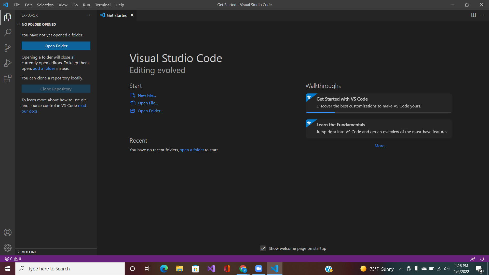
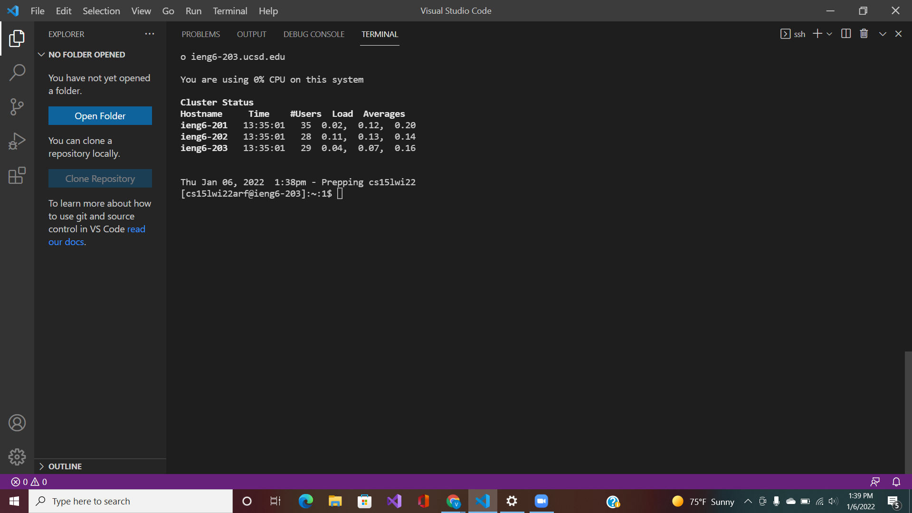
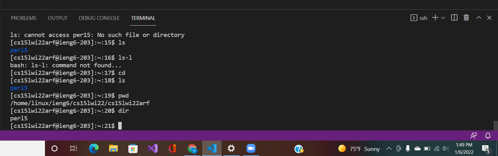
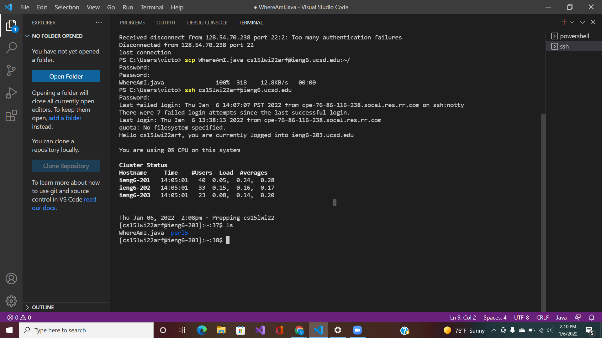
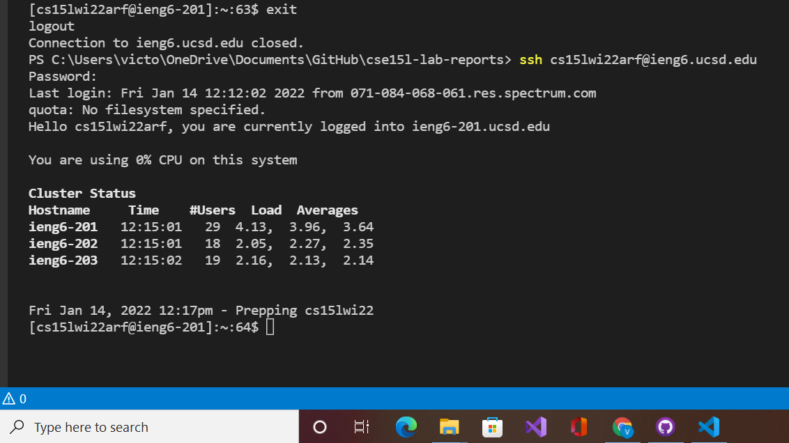

# How To Log Into a Course-Specific Account On ieng6

## Installing VScode
[VScode](https://code.visualstudio.com/)

In order to install VScode, you will need to click on the link above. This link provides instruction on how to download VScode specific to your operating system. When it is installed successfully, you should see a window that looks like the picture below. 

> This may look different depending on the operating systems as well as the color schemes chosen for your VScode.

## Remotely Connecting
To remotely connect you would start by downloading a program called [OpenSSH](https://docs.microsoft.com/en-us/windows-server/administration/openssh/openssh_install_firstuse). This program is specific to Windows users.Then you are going to connect remotely through VScode, so you have to open the application up. Once VScode is open you are going to enter your course-specific account in the command line of your terminal. You are then going to enter your password and end up with a screen that looks like: 

## Trying Some Commands
To try some commands, you would simply type the command into the command line of your terminal. 
Here are a list of commands to get you started:
- cd: `changes to previous directory`
- cd~: `takes you to the home directory`
- ls: `lists the files in the current directory`
- Ls-l: `long listing(shows: who can read the file, chracter/bytes in file, date modified, etc)`
- Pwd: `prints the working directory(shows the file path)`
- Ssh: `secure shell`
- CP: `copy file`

After running a couple commands your terminal should look similar to this:

## Moving Files with scp

To move files from the client (your computer) to the server, you can create a file tehen use the command `scp`. When running the command `scp <file name>.java cs15lwi22zz@ieng6.ucsd.edu:~/`, you will be prompted to login and using the ls command, that new file wile be in your home directory. 

## Setting an SSH Key

In order to create an SSH key you will need to run the command, `ssh-keygen` in your client terminal, which creates a public and private key. The private key is stored in a file called `is_rsa` and the public key is stored in a file called `is_rsa.pub`. In order to copy the public key into the directory of your server account do the following:

1. log into your server account
2. make a new directory, `ssh`
3. log out of your server
4. run the command `scp /Users/joe/.ssh/id_rsa.pub cs15lwi22@ieng6.ucsd.edu:~/.ssh/authorized_keys`
5. try the commands `ssh` and `scp` which should now automatically connect the client to the server without the need for a password

## Optimizing Remote Running

To optimize remote running between clients and servers, you can implement the command methods learned above. For example:

* `ssh cs15lwi22@ieng6.ucsd.edu "ls" `: allows you to log into the server directly and will list the home directory on the remote server

* `cp WhereAmI.java OtherMain.java; javac OtherMain.java; java WhereAmI` the use of semicolos, allows for you to run multiple commands on the same command line
* `use the up, down arrows`: use the last command that you ran
