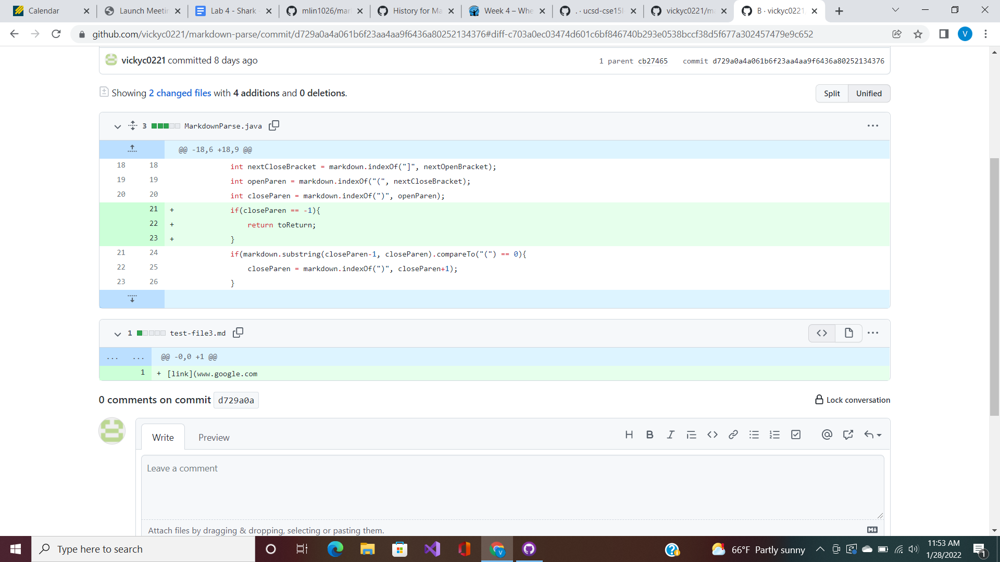
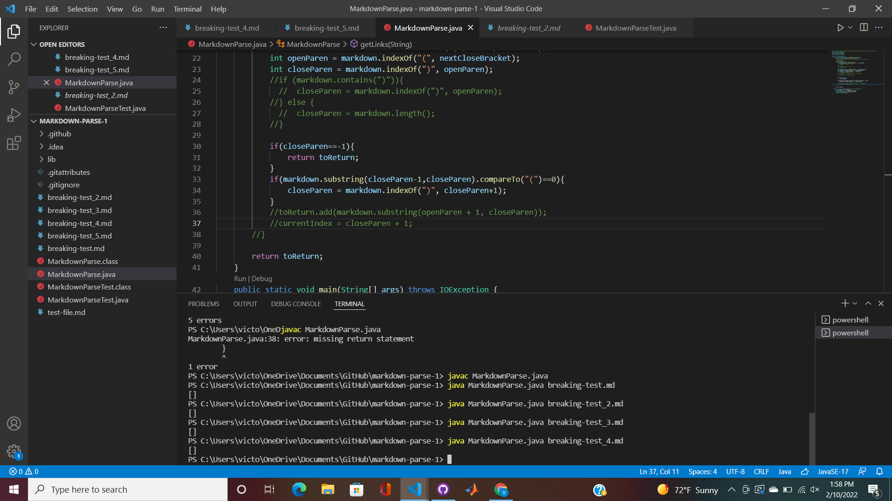
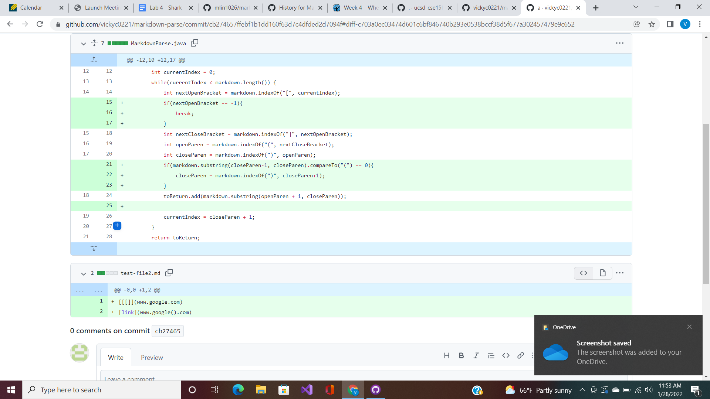
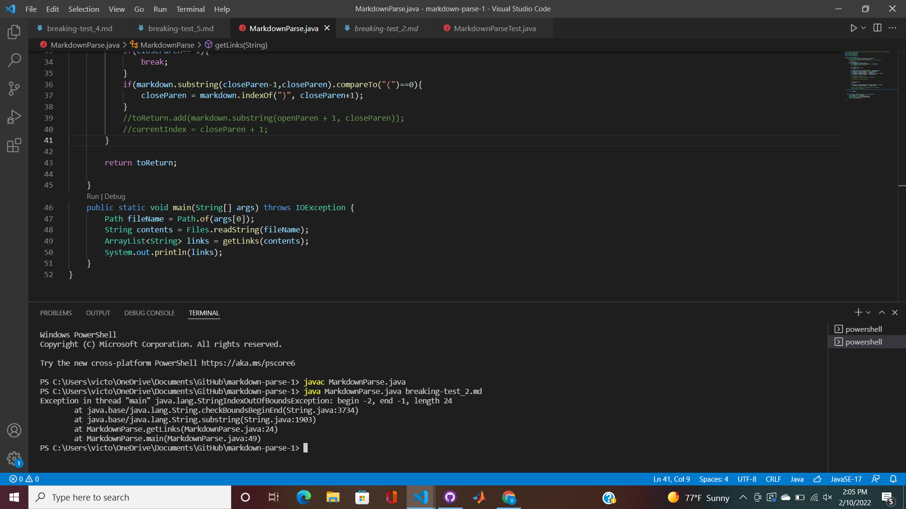
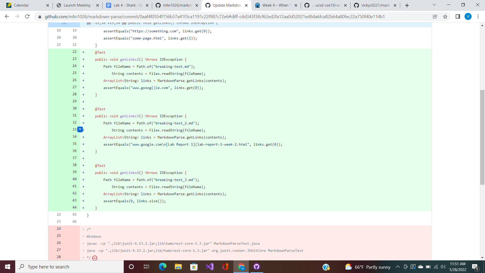
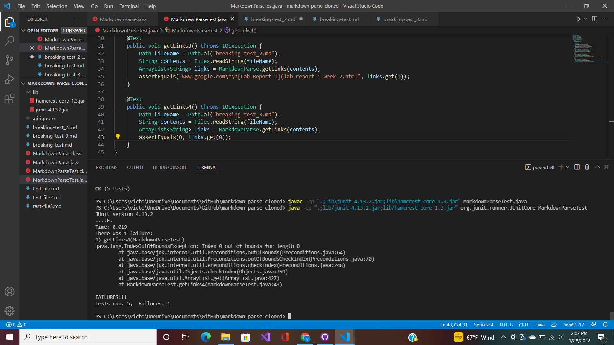

# Fixing A Bug
## Bug Code Change 1:



**The test files for a failure-inducing input that prompetd you to make that change:**

[Test File 1](test-file1.md)

[Test File 2](test-file2.md)

[Test File 3](test-file3.md)

[Test File 4](test-file4.md)

**Symptoms:**


The bug was causing the print statement to be exactly the same thing every single time, an empty array. Our expected outcome was the contents of the file. However our code was not adding anything to the variable "toReturn," so we needed to add a line of code that would return the contents of the file.

## Bug Code Change 2:



**The test file for a failure-inducing input that prompted you to make that change:**

[Test File](test-file2.md)

**Symptoms:**


The symptom for this bug was that we had an out of bounds for the index -2. Because our test file contains no clsoe paranthesis, when our 21st line of code is ran, we get an index of -2. Therefore, before our code hits this line, we need to terminate the program if the index is -1 by putting a break statement before that if statement.

## Bug Code Change 3:




**The test file for a failure-inducing input that prompted you to make that change:**

[Test File](test-file3.md)

**Symptoms:**


The bug was that out index was out of bounds for ```get(Index)```. Since our file is empty the expected outcome was 0, however the terminal returned an out of bounds error, since there was no elements in our array. Because our expected outcome was nothing, we just returned the size of the link as opposed to the elements in the link.
