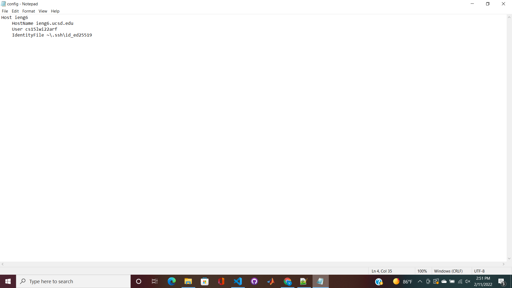
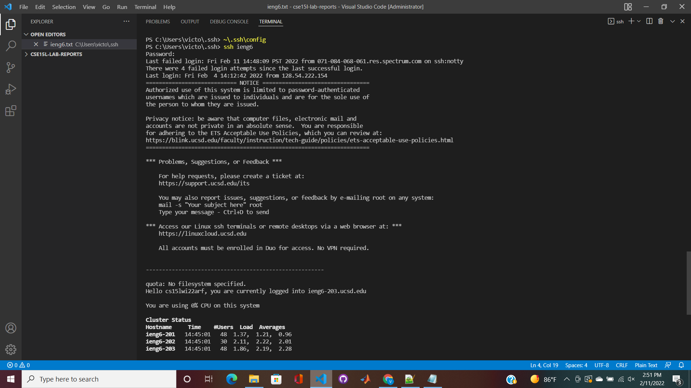
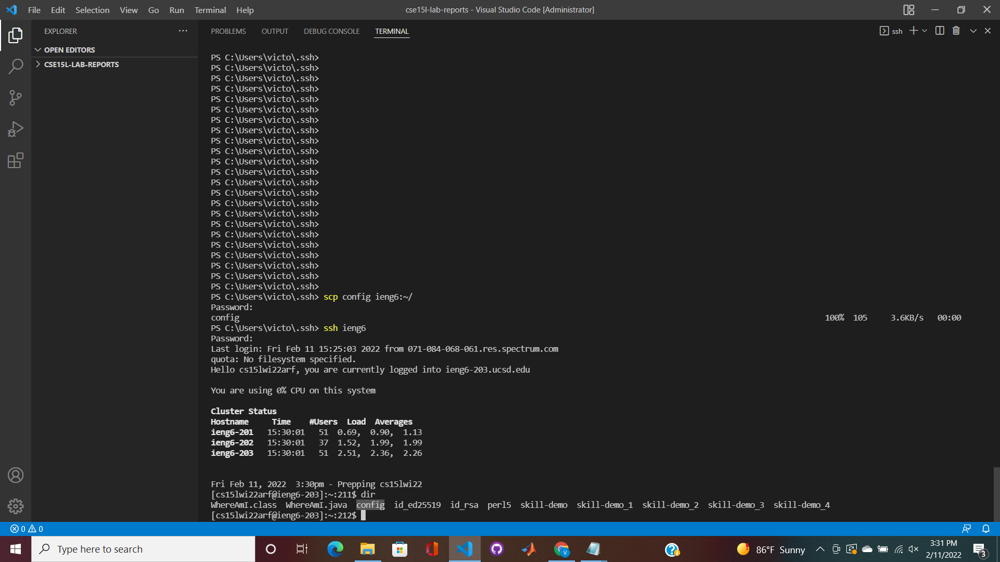

# Streamlining ssh Configuration

## File/Editor

>Created a new file using windows built-in notepad.

## ssh Command Login

>ssh command logging into account using alias, **ieng6**

## scp Command Copy File

>scp command copying file into account using alias
