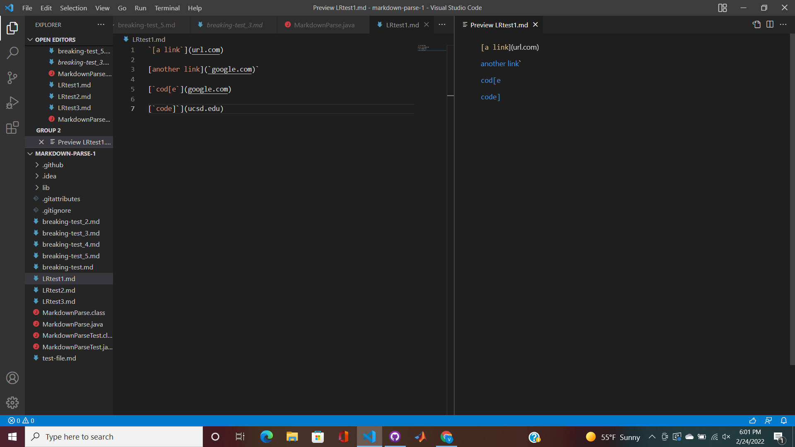
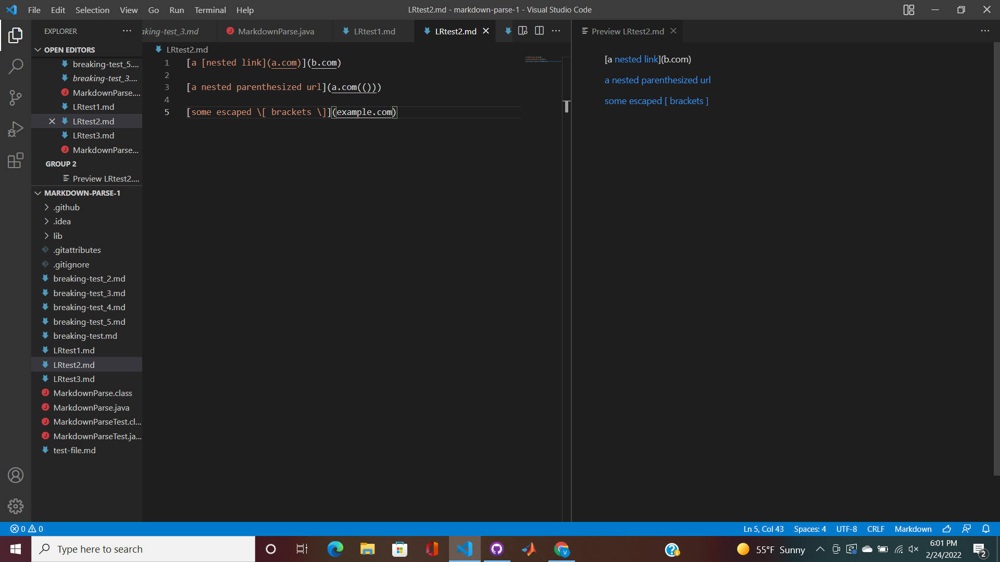
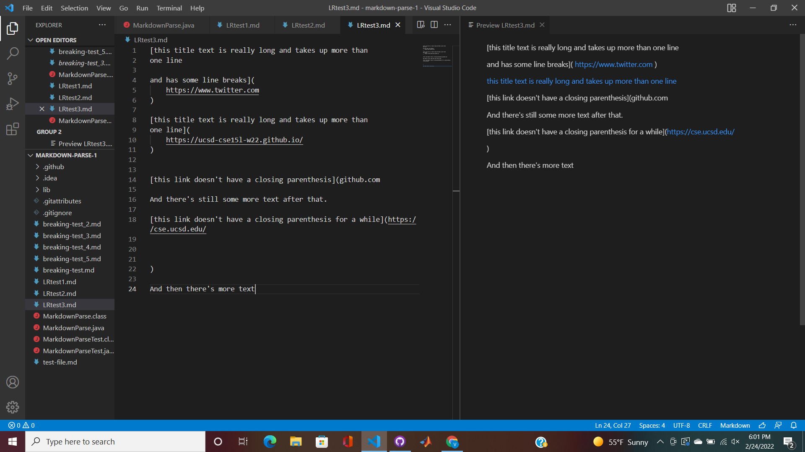
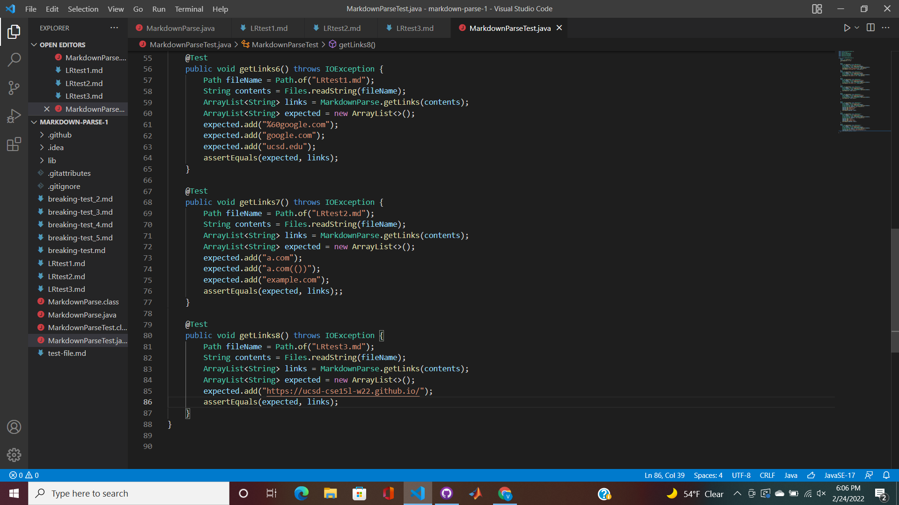
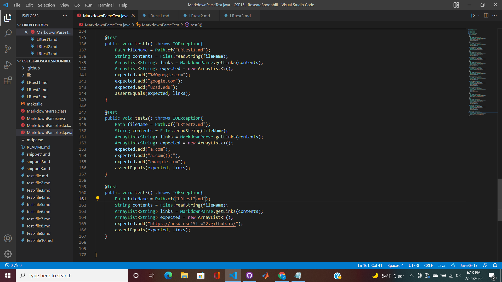
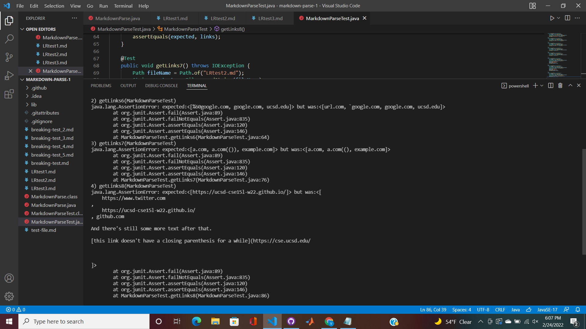
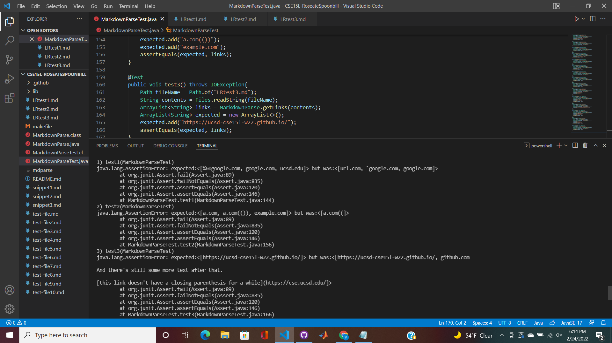

# Week 8 Lab Report

## Links to Repositories
- [My Repository](https://github.com/vickyc0221/markdown-parse-1)

- [Reviewed Repository](https://github.com/CatherineGu16/markdown-parse)

## Expected Outcome
For Snippet 1:

For Snippet 2:

For Snippet 3:

## Implement Tests
Our new test cases:

Their new test cases:

## Test Results
Our test results:

Their test results:

## Questions
**Question 1:** Do you think there is a small (<10 lines) code change that will make your program work for snippet 1 and all related cases that use inline code with backticks? If yes, describe the code change. If not, describe why it would be a more involved change.

**Answer:** We could implement a code the way that we did to ignore the ! previously. We could have a portion of code dedicated to filtering through the backticks and working around them.

**Question 2:** Do you think there is a small (<10 lines) code change that will make your program work for snippet 2 and all related cases that nest parentheses, brackets, and escaped brackets? If yes, describe the code change. If not, describe why it would be a more involved change.

**Answer:** I think it would be a more involved code. There are a lot of requirements to filter through when looking through a link that has multiple brackets, paranthesis and escaped brackets. So you would need to implement a code that iterates through the whole line looking past these things. 

**Question 3:** Do you think there is a small (<10 lines) code change that will make your program work for snippet 3 and all related cases that have newlines in brackets and parentheses? If yes, describe the code change. If not, describe why it would be a more involved change.

**Answer:** For snippet three I think it would be possible. One way to go about this is to use the trim() method for any white space. 
